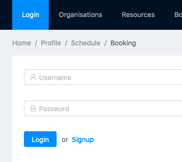
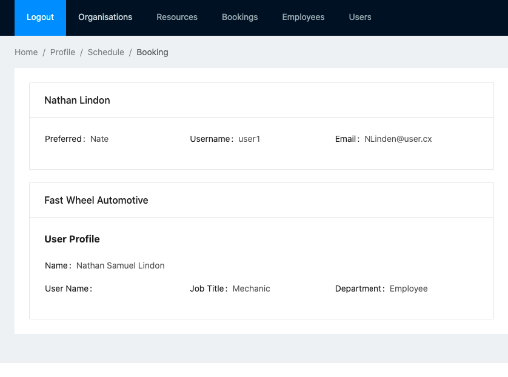
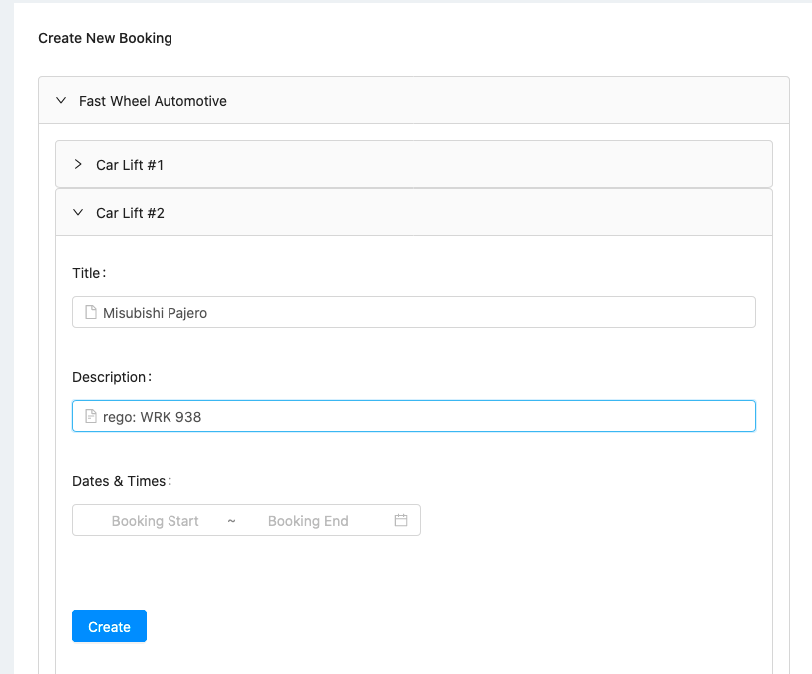

<h1>Resource Scheduler</h1>
Resource Scheduler is a utility for resource booking. Users can book resources depending on their afilliated organisations. 

The application is able to manage resources for multiple organisations. 

Administrators are able to:

<ul>
<li>Create organisations</li>
<li>Create resources and assign them to organisations</li>
<li>Create users and assign them to one or more organisations</li>
</ul>

Users are able to:
<ul>
<li>View their bookings</li>
<li>Create / Edit / Delete bookings for resources available to them</li>
<li>Edit / Delete bookings</li>
</ul>

<h3>Notes on the demo version</h3>
<h4>No permission filtering</h4>
There is no administration filtering in this demo version. All users are able to view unfiltered versions of the Bookings, Resources, Organisations and Users list. All users are also able to create new organisations and resources.

<h4>Cannot create users</h4>
You will not be able to create new users in this app. You can assign existing ones to organisations

<h2>Built Using</h2>
<ul>
  <li>React</li>
  <li>Django</li>
  <li>AntD</li>
</ul>

<h2>Application Features</h2>
<ul>
  <li>User views are filtered according to their profile</li>
  <li>Schedule view displays bookings organised by the user</li>
  <li>When making a booking, reserved dates and times are filtered out</li>
  <li>Users can be assigned to multiple organisations</li>
</ul>

<h2>Installation</h2>
<h3>Prerequisites</h3>
If you wish to download and run a local copy of the software, please ensure you have the following prerequisites:
<ul>
  <li>Google Cloud Services Client ID for Web Application</li>
  Note the following information:
  <ul>
    <li>Client ID</li>
    <li>Client Secret</li>
    <li>The urls of your own web applications</li>
  </ul>
</ul>

<h3>Steps for back-end installation</h3>

1. Clone backend from Github: 

<code>git clone https://github.com/RCode-Blue/ResourceScheduler_Back.git</code> 

2. Create and start virtual environment

<code>
virtualenv venv --python=python3.7
source venv/bin/activate
</code>

3. Install libraries

<code>pip install -t requirements.txt</code>

4. Set environment variables

<code>export DJANGO_ENV=dev</code>

5. Start server

<code>python manage.py runserver</code>

<h3>Steps for front-end installation</h3>

1. Clone front-end from Github:

<code>git clone https://github.com/RCode-Blue/ResourceScheduler_Front</code>

2. Install libraries

<code>npm install</code>

3. Start server

<code>npm start</code>

<h2>Usage Demo</h2>

<li>Login</li>

</img>

<li>Check user profile</li>

</img>

<li>Create a booking</li>

</img>

